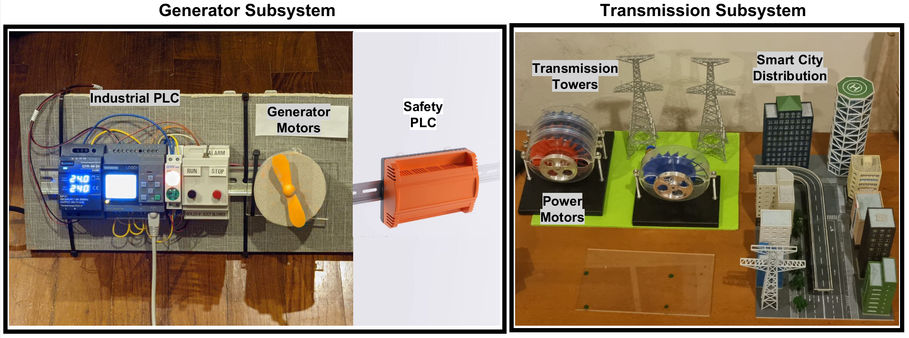
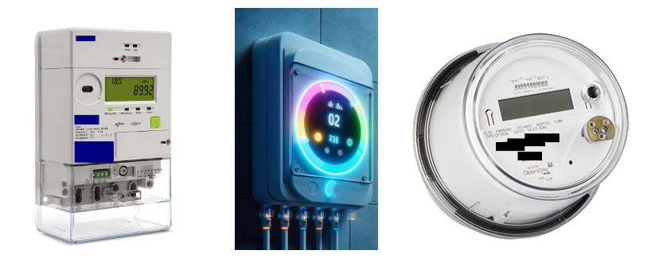

# Power Grid Research

## Introduction

Welcome to the open-source repository for "Circuit Breaker CTF". This project aims to introduce vulnerability research and security techniques for several critical devices used in the smart grid power industry. We have created a testbench covering devices in the Energy Generation, to Transmission Lines, to Consumer & Homes. 

With this repository, we will walk through each exhibit: addressing challenges related to cybersecurity and physical vulnerabilities in power grids.

## Hardware Exhibits

[Exhibit 1: Power Generator Village](./power_generator/)
- The Power Generator Village exhibit demonstrates vulnerabilities in power generation systems, including grid desynchronization and overvoltage risks.
- 

[Exhibit 2: Smart Meter Village](./smart_metering/)
- The Smart Meter Village exhibit highlights the security challenges in modern smart meters, showcasing how communication protocols can be exploited to manipulate data, alter configurations, or inject false commands.
- 

## Network Configuration

IP Address | Device | Remarks
--- | --- | ---
192.168.77.1 | Default Gateway | Router
192.168.77.55 | PLC | Miniature PLC for Soot Blower
192.168.77.77 | PLC | Industrial PLC for Power Generation
192.168.77.88 | HMI | HMI for Power Generation
192.168.77.99 | HMI | HMI for Soot Blower
Isolated | Safety | Safety PLC for Transmission Lines
