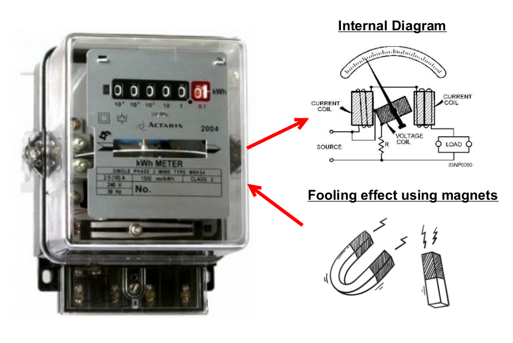
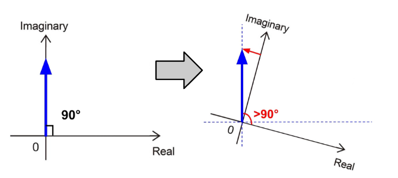

# Electrical Metering

## Meter Fooling Technique

We provide the participants with LED lights and an industrial transformer.

1. Firstly, connect the LED lights only. Observe that the meter dial rotates in the forward direction (moving towards the right). Notice that the power factor is 0.9~1 and is relatively good.

2. Secondly, turn on the industrial transformer. Observe that the meter dial slows down significantly. Notice that the power factor dropped to around 0.5~0.6.

3. Lastly, turn off the LED lights. Observe that the dial is turning backwards. The power factor has dropped further to 0.1~0.3.

To summarize, we observe that the kWh meter is non-ideal and has limitations. Hence, there exists some special circuitry that has caused the meter to be electrically out-of-spec and affect the integrity of the meter readings.

## Theory Explanation

For the industrial transformer that we provide, it consists of very large wire coils. It can be thought of as a large inductance. The kWh meter will not rotate since no active power is being consumed.

However, in the real world, the kWh meter itself is not ideal. The kWh meter itself is an inductive component as it is made up of coils. It makes use of these coils to cause an electromechanical rotation on the dial for the meter counter mechanism. This rotation is calibrated to be in proportion to the amount of energy used.

At a quick glance, we see the current coil and pressure coil. The long coil of wires in the kWh meter itself can be thought of as a mixture of resistance and inductance.

However now, the rotation is due to the non-ideal meter, instead of the consumer’s appliance. Therefore instead of rotating the resultant arrow on the graph, we can think of it as a rotation of the whole axis itself.

We now see that the inductor with a resultant of 90°, it now appears to have a component on the negative real axis (highlighted in red above). This is why the meter turns backwards.
