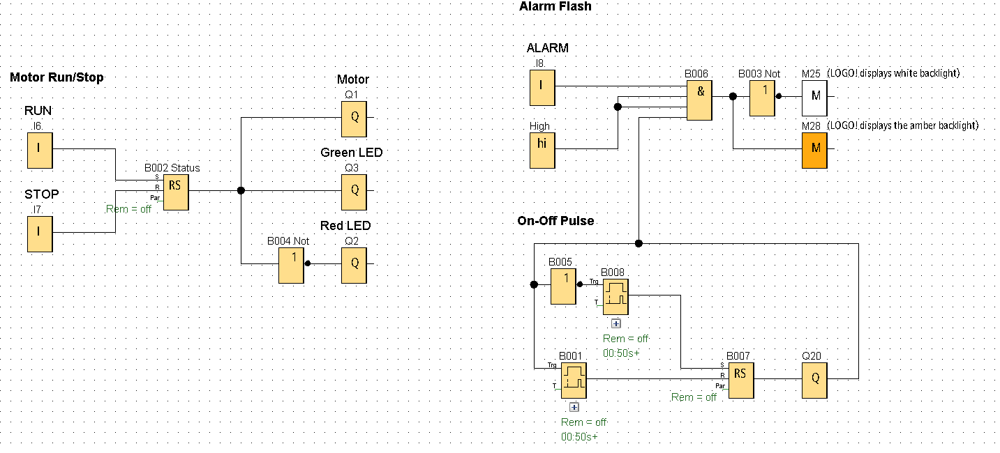
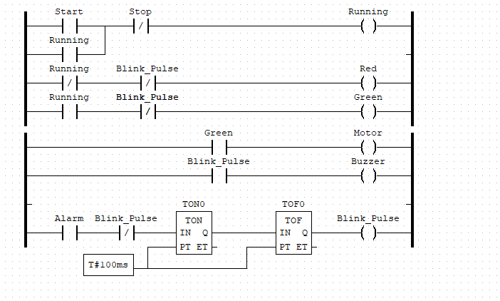
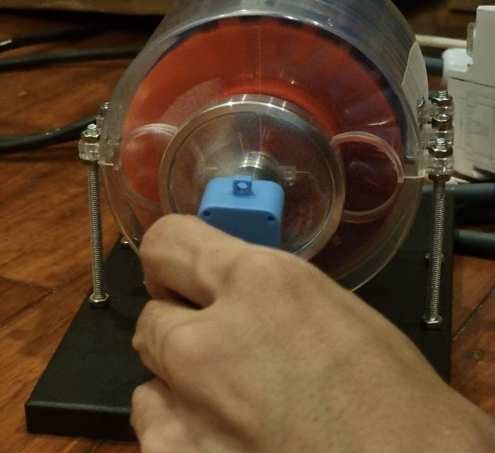
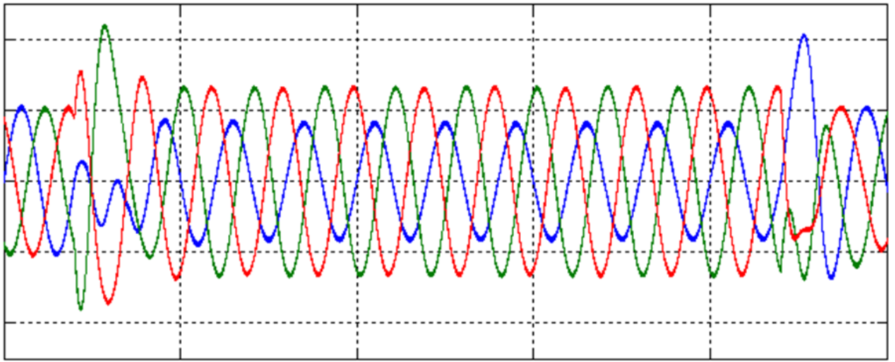
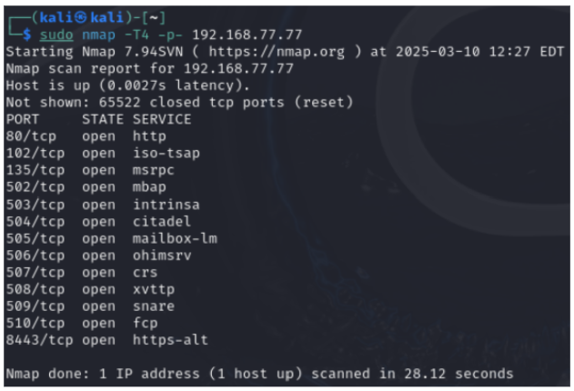
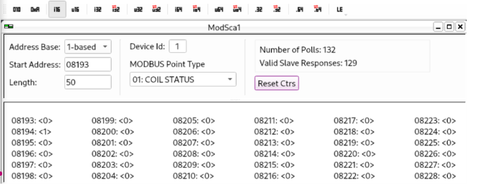
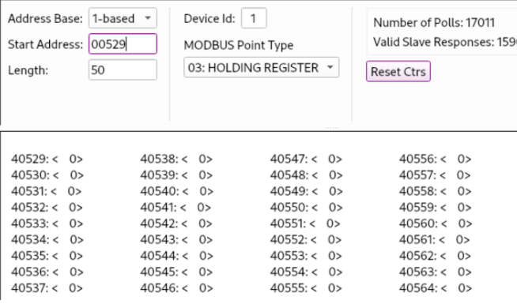

# Power Generator Village

## Generator Subsystem

The SCADA system for power generator controls consists of an industrial PLC.

**The PLC Code is [provided here in OpenPLC format](plc_openplc.xml).**

Alternatively, we have converted it into block and ladder formats to program proprietary PLCs as well.

**Block Program**

**Ladder Diagram**

## Transmission Subsystem

The power transmission to the smart city is safeguarded by a safety PLC and extensive circuit breakers. The wiring diagram is as follows:

During the demo, we may intentionally trigger a grid desynchronization event within the Generator Subsystem. The device-under-attack is the variable frequency controller for the generator motors. We may cause severe instabilities, such as overvoltage or short circuits.

In such scenarios, the generator motors lose synchronization with the grid to trigger the safety PLC. Under extreme conditions, the fault may propagate upstream, leading to a critical circuit breaker tripping at a higher level and causing a large-scale blackout in the smart city.

## Task 1: Enumeration of the PLC

On Kali, use nmap to scan the PLC: `sudo nmap -T4 -p- 192.168.77.77 `

We will focus on Port 502 (used by Modbus)

Notice the starting address is 8193. Also, notice that the first starting address for coil is “1”, which means that the indexing and starts from 1 (unlike the testbench, which starts at “0”)

Likewise, to read the holding registers, set the MODBUS Point Type to "Holding Register" and choose 529 for the AM address type.

Here, Smart City is not started and Power Generator is not running yet

## Task 2: Perform Underfrequency Attack

To turn on the generator, run the following command: “modbus 192.168.77.77:504 c@8256=1”.

Notice that:
- Coil 8194 becomes 0 (False) while Coil 8195 becomes 1 (True), indicating that Coil 8195 represents the generator's output state (spinning).
- Coil 8257 is set to 1 (True), reflecting that the generator is currently running.
- Holding address 40529 displays 50, which likely represents the generator's operating frequency of 50Hz.

Execute the malicious command to lower the frequency value of the generator: “modbus 192.168.77.77:504 h@528=10”. This command is crafted to set the generator's operating frequency to 10Hz.

If you look closely, you might observe the value briefly dipping to 10 for about a second before returning to 50. This occurs because the PLC is programmed to maintain a constant frequency of 50Hz during operation. To override this, you need to inject the malicious command repeatedly so that the memory value of the holding register is continually modified, tricking the PLC into maintaining the new frequency value (for example, 10Hz). 

If the underfrequency attack is successful, you'll notice that the smart city's lights are dimmer than usual, and holding register 40529 consistently displays a lower value (10 in this instance).

## Task 3: Perform Overfrequency Attack

To carry out an overfrequency attack, first determine the maximum frequency that the generator can support. Begin by gradually increasing the frequency values. You may issue the command similar to the following: `modbus 192.168.77.77:504 h@528=60`

Notice that the smart city lights are getting brighter. 

To bypass the safety check on the offline Safety PLC, you must issue the command continuously. This tricks the PLC into believing that the constant frequency is 999Hz (or whatever value you input), which forces the safety PLC to protect against the excessive power downstream, triggering the circuit breaker and immediately halting the power generation process.

Command: `modbus 192.168.77.77:504 h@528=999`

If the overfrequency attack succeeds, you'll observe that the Smart City loses all power because the safety PLC has tripped the circuit breaker
