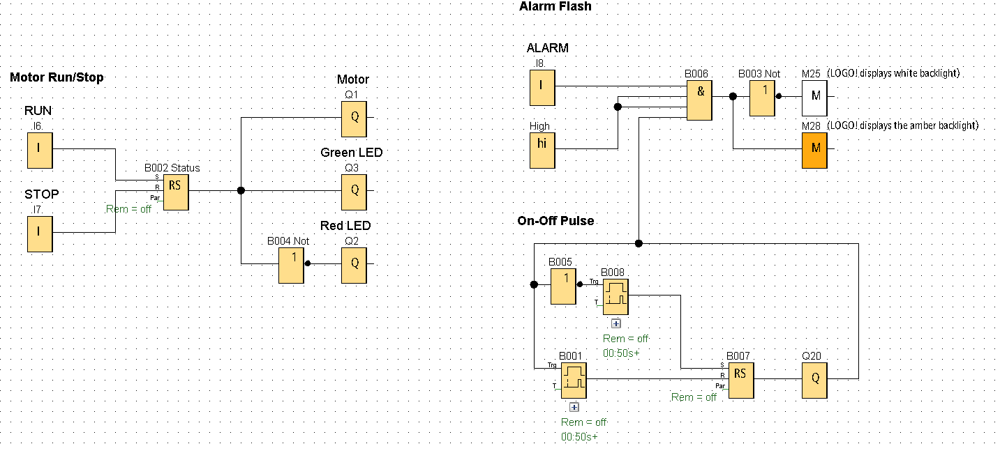
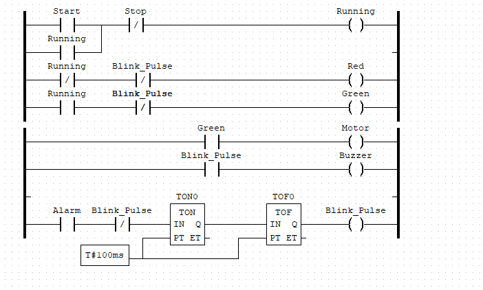
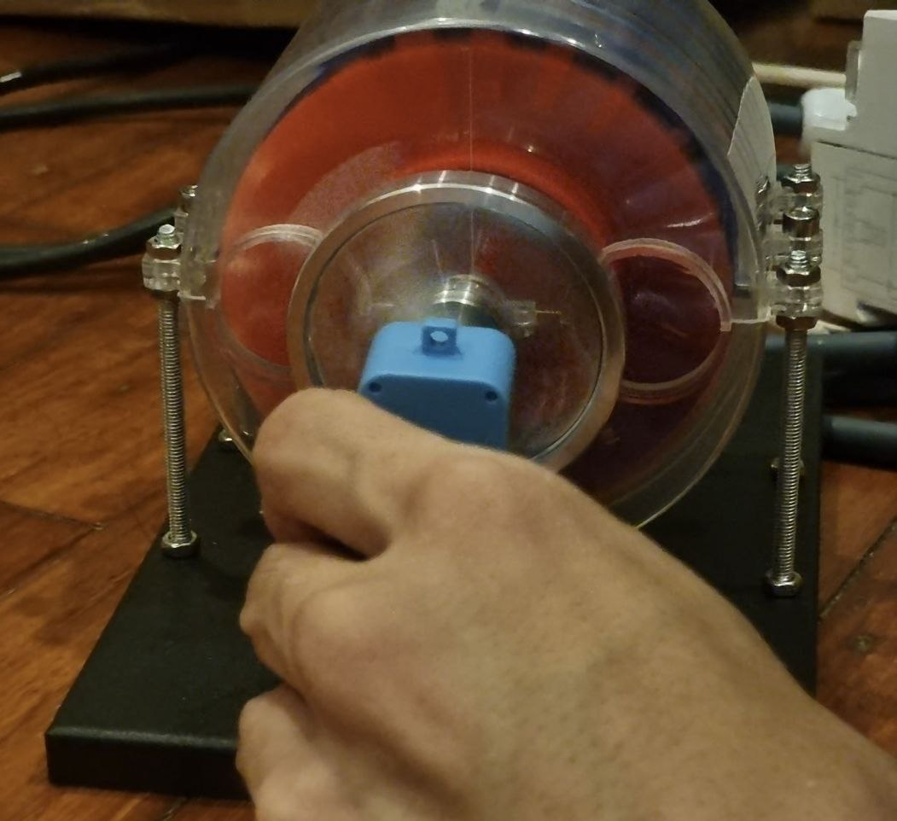
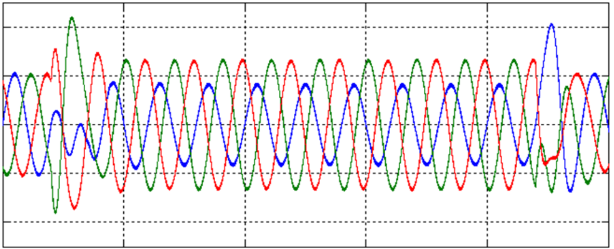

# Exhibit 1: Power Generator Village

## Generator Subsystem

The SCADA system for power generator controls consists of an industrial PLC.

**The PLC Code is [provided here in OpenPLC format](plc_openplc.xml).**

Alternatively, we have converted it into block and ladder formats to program proprietary PLCs as well.

**Block Program**

**Ladder Diagram**

## Transmission Subsystem

The power transmission to the smart city is safeguarded by a safety PLC and extensive circuit breakers. The wiring diagram is as follows:

During the demo, we may intentionally trigger a grid desynchronization event within the Generator Subsystem. The device-under-attack is the variable frequency controller for the generator motors. We may cause severe instabilities, such as overvoltage or short circuits.

In such scenarios, the generator motors lose synchronization with the grid to trigger the safety PLC. Under extreme conditions, the fault may propagate upstream, leading to a critical circuit breaker tripping at a higher level and causing a large-scale blackout in the smart city.

