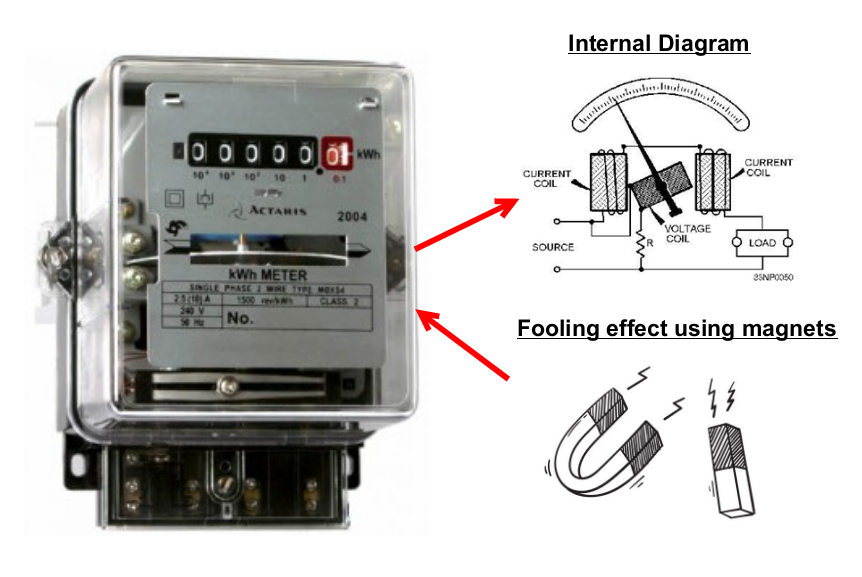
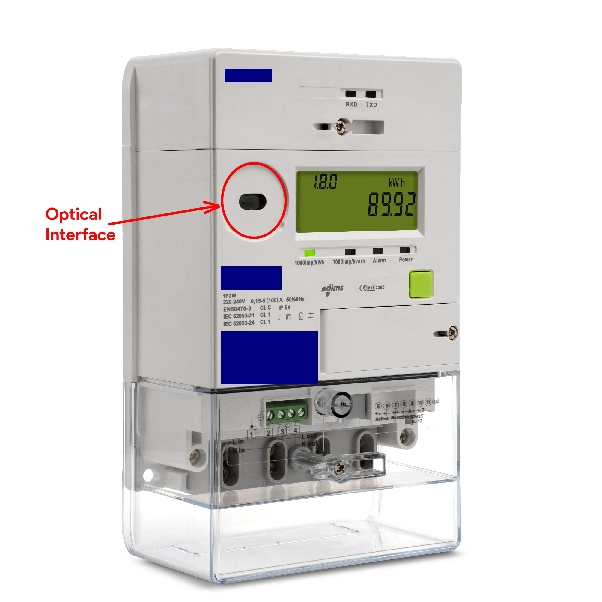
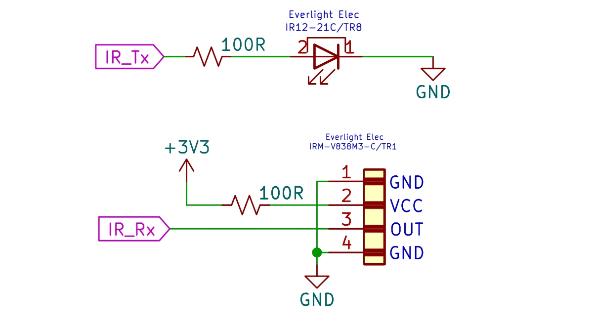

# Exhibit 2: Smart Meter Village

## Meter Fooling Technique

In internal diagram, the wire coil generates a magnetic field when electric current flows through it. This creates a rotational force which allows the accurate measurement of electrical current through the power meter.

By using a magnet to apply drag onto the rotating disc of a mechanical analog power meter, we can interfere with the meter’s ability to accurately measure electricity consumption. The method involves targeting the specif area of the coiled wire around the disc.

## Attack Vector using Optical Interface

Communication protocol in digital smart meters can be intercepted or manipulated, allowing attackers to alter meter configurations and tamper to cause inaccurate billing over the optical interface.

This is an example of a smart meter and we identify the optical interface:

The hardware layer requires an optical interface and we have designed the circuitry as so:

