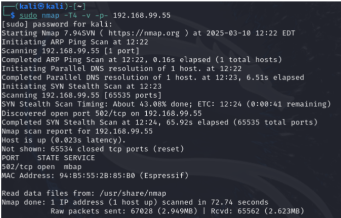
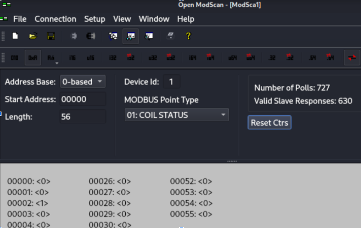
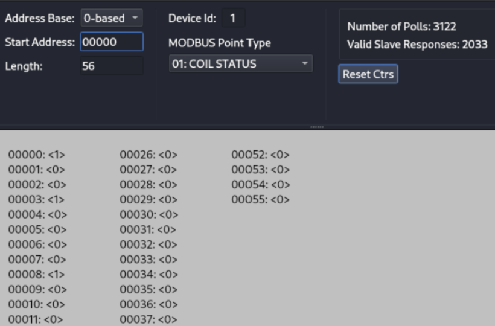
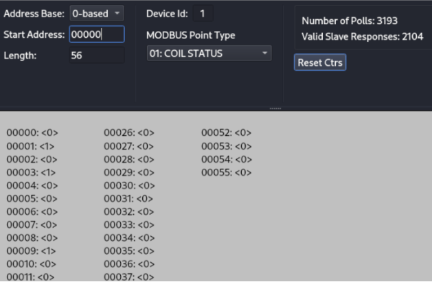
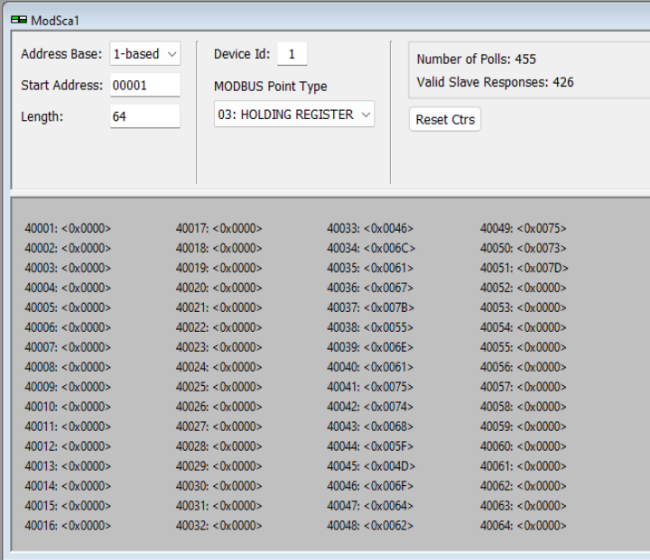
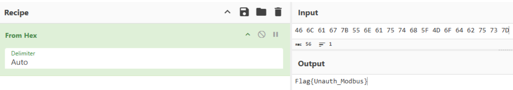

# PLC Testbench

## Lab 1: Physical Interaction with the Testbench

After engaging with the testbench firsthand, you should be able to draw the following conclusions:

- When the fan is stopped, pressing the green button will start it, spinning in a clockwise direction by default.
- Pressing the green button again will switch the spinning direction from clockwise to anti-clockwise.
- Pressing the red button will halt the fan's rotation.

## Lab 2: Enumerating the PLC

On Kali, use nmap to scan the PLC: `sudo nmap -T4 -v -p- 192.168.99.XX` (Check the IP address of the TestBench you are assigned to). It may take some time for the scan results to show up.

Once the nmap scan has completed, notice it only returns port 502, which corresponds to the Modbus protocol the PLC uses to communicate with the fan.

## Lab 3: Overriding the intended fan operation

### Task 1: Enumeration of PLC

Using a Modbus viewer such as Open ModScan, we can view the coils along with their corresponding values like so:

In the screenshot above, observe that coil address 2 displays a value of 1, likely indicating a True state, while no values are associated with the other coils. Since the TestBench is currently off and the red LED is lit, we can infer that coil 2 corresponds to the red LED state.

### Task 2: Mapping Fan Behaviour to Coil Addresses

Turn on the TestBench by pressing the physical green button. You should see the fan start spinning clockwise. Then, observe the state changes in the coils using the ModScan tool.

Notice that coil addresses 0, 3, and 8 have switched from False to True, while coil address 2 has changed from True to False. Observing the TestBench, you'll see that the red LED is no longer lit, and the green LED is now illuminated, indicating that the fan is spinning. Based on these observations, we can hypothesize that:
- Coil 3 corresponds to the Green LED state (given that coil 2 represents the Red LED state).
- The roles of coils 0 and 8 require further investigation.

Now, press the green button again. The fan will begin spinning in the opposite direction - anti-clockwise. Observe the state changes in the coils using the ModScan tool.

In the ModScan tool, you'll notice that coil 3 remains True, while coils 1 and 9 become True, and coils 0 and 8, which were previously True, now switch to False. Based on these observations, along with the data from when the fan was spinning clockwise, we can infer that coils 0 and 8 are interdependent with the fan's operating state, and similarly for coils 1 and 9.

Press the green button once more. Observe that the fan has switched from anti-clockwise to clockwise rotation. On the ModScan tool interface, you'll notice that the coil addresses now reflect the same state as seen in Step 9, confirming that the green button alternates the spin direction.

Press the red button and observe that the fan comes to a stop. Additionally, all coils show a False value except for coil 2, which remains the same as observed in Step 4.

You have successfully mapped the relevant coils to the corresponding functions of the PLC.

### Task 3: Disrupt the Fan Operation

Run the command to install the tool via the package manager: `pip install modbus-cli`

As an example, to start the fan, issue the command `modbus 192.168.99.55:502 c@0=1` to activate coil 0.

Next, to change the fan's rotation to anti-clockwise, activate coil 1 by issuing the command `modbus 192.168.99.55:502 c@1=1`.

To deliberately induce a short circuit that trips the circuit breaker and stops the fan, we will remotely set both coils 0 and 1 True simultaneously by issuing the command: `modbus-cli 192.168.99.55:502 c@0=1 c@1=1`.

You should observe that the Circuit Breaker trips, and the fan is no longer spinning. The attack was successful!

## Lab 3: Identify the Flag!

To display the data from the holding registers in a readable format, toggle the settings above to show values in hexadecimal. This makes it much clearer that holding register addresses 40033 to 40051 contain data.

To decipher the meaning of the hexadecimal values, we can use open-source tools such as Cyberchef, which is easy to use for beginners. Open up a browser on Kali and enter “https://gchq.github.io/CyberChef/”.  

